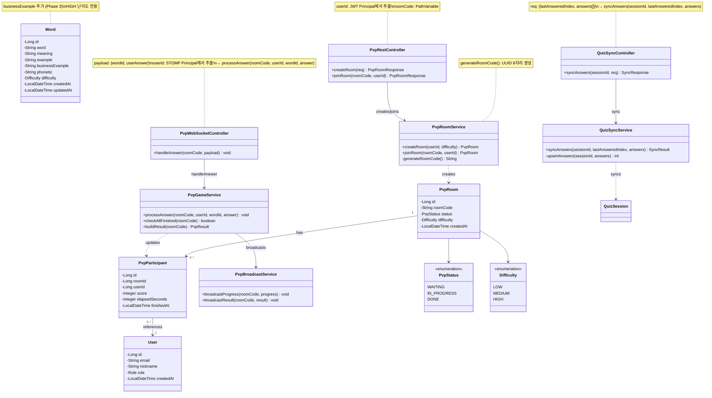

# Class Diagram

## Phase 1 — MVP (SSO 로그인 · 단어 카드 · 주관식 퀴즈 · 오답노트 · 관리자 CRUD)

```mermaid
classDiagram
  direction TB
  class User {
    -Long id
    -String email
    -String nickname
    -Role role
    -LocalDateTime createdAt
  }
  class Word {
    -Long id
    -String word
    -String meaning
    -String example
    -Difficulty difficulty
    -LocalDateTime createdAt
    -LocalDateTime updatedAt
  }
  class QuizSession {
    -Long id
    -Long userId
    -Difficulty difficulty
    -Direction direction
    -SessionStatus status
    -LocalDateTime createdAt
  }
  class QuizAnswer {
    -Long id
    -Long sessionId
    -Long wordId
    -String userAnswer
    -Boolean isCorrect
  }
  class WrongNote {
    -Long id
    -Long userId
    -Long wordId
    -Boolean isResolved
    -LocalDateTime createdAt
  }
  class QuizService {
    +startQuiz(userId, difficulty, direction) QuizStartResponse
    +submitQuiz(sessionId, answers) QuizResult
    +getResult(sessionId) QuizResult
    -grade(userAnswer, correct) boolean
  }
  class QuizStartResponse {
    -Long sessionId
    -List questions
  }
  class Role {
    <<enumeration>>
    USER
    ADMIN
  }
  class Difficulty {
    <<enumeration>>
    LOW
    MEDIUM
    HIGH
  }
  class Direction {
    <<enumeration>>
    KO_EN
    EN_KO
  }
  class SessionStatus {
    <<enumeration>>
    IN_PROGRESS
    DONE
  }
  User "1" --> "0..*" QuizSession : starts
  User "1" --> "0..*" WrongNote : has
  QuizSession "1" --> "0..*" QuizAnswer : contains
  QuizAnswer "0..*" --> "1" Word : references
  WrongNote "0..*" --> "1" Word : references
  QuizService ..> QuizSession : creates
  QuizService ..> QuizStartResponse : returns
  User --> Role
  Word --> Difficulty
  QuizSession --> Difficulty
  QuizSession --> Direction
  QuizSession --> SessionStatus
```

---

## Phase 2 — 엑셀 업로드 · 랭킹 · 이어풀기 · TTS 발음기호 · 관계어 · 숙어 · 오답 해제

```mermaid
classDiagram
  direction TB
  class Word {
    -Long id
    -String word
    -String meaning
    -String example
    -String phonetic
    -Difficulty difficulty
    -LocalDateTime createdAt
    -LocalDateTime updatedAt
  }
  class QuizSession {
    -Long id
    -Long userId
    -Difficulty difficulty
    -Direction direction
    -SessionStatus status
    -Integer lastAnsweredIndex
    -LocalDateTime createdAt
  }
  class WordRanking {
    -Long id
    -Long wordId
    -Integer wrongCount
    -LocalDateTime rankedAt
  }
  class WordRelation {
    -Long id
    -Long wordId
    -String synonyms
    -String antonyms
    -String derivatives
    -LocalDateTime cachedAt
  }
  class WordPhrase {
    -Long id
    -Long wordId
    -String phrase
    -String phraseMeaning
    -LocalDateTime cachedAt
  }
  class RankingService {
    +getRanking() List~RankingDto~
    +refreshRanking() void
  }
  class ExcelUploadService {
    +preview(file) PreviewResponse
    +upload(file) UploadResponse
    -parseRows(sheet) List~PreviewItem~
    -validateDifficulty(val) boolean
  }
  note for ExcelUploadService "UploadResponse: {savedCount: Int, skippedRows: List~Int~}\nPreviewResponse: {preview: List~PreviewItem~, skippedRows: List~Int~}"
  class RankingScheduler {
    +refreshDailyRanking() void
  }
  class QuizResumeService {
    +getInProgressSession(userId) Optional
    +saveAnswer(sessionId, wordId, answer) QuizAnswer
    +getHistory(userId) List
  }
  class WordRelationService {
    +getRelations(wordId) RelationDto
    +getPhrases(wordId) List~PhraseDto~
    -callOpenAI(prompt) String
  }
  class WrongNoteService {
    +resolveWrongNote(id, release) WrongNote
  }
  note for WrongNoteService "release: Boolean — true 시 isResolved=true로 갱신"
  class SessionStatus {
    <<enumeration>>
    IN_PROGRESS
    ABANDONED
    DONE
  }
  note for Word "phonetic 컬럼 추가 (Phase 2)"
  note for QuizSession "lastAnsweredIndex 추가\n이어풀기 지원 (Phase 2)"
  note for RankingService "refreshDailyRanking(): Scheduler 진입점\n내부에서 refreshRanking() 호출"
  WordRanking "1" --> "1" Word : ranks
  WordRelation "1" --> "1" Word : describes
  WordPhrase "0..*" --> "1" Word : belongs to
  QuizSession --> SessionStatus
  ExcelUploadController ..> ExcelUploadService : uses
  RankingScheduler --> RankingService : refreshDailyRanking→refreshRanking
  QuizResumeService ..> QuizSession : manages
  WordRelationService ..> WordRelation : caches
  WordRelationService ..> WordPhrase : caches
```

---

## Phase 3 — PvP 실시간 대결 · 비즈니스 예문 · 오프라인 동기화

