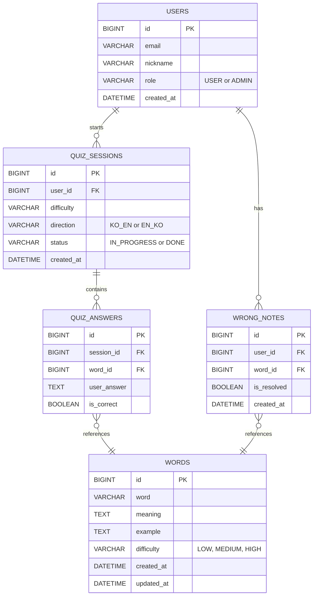
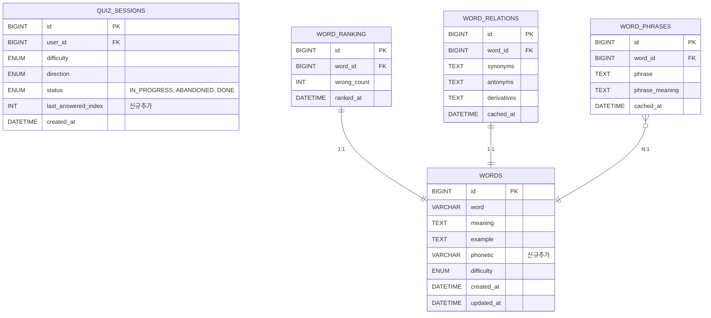
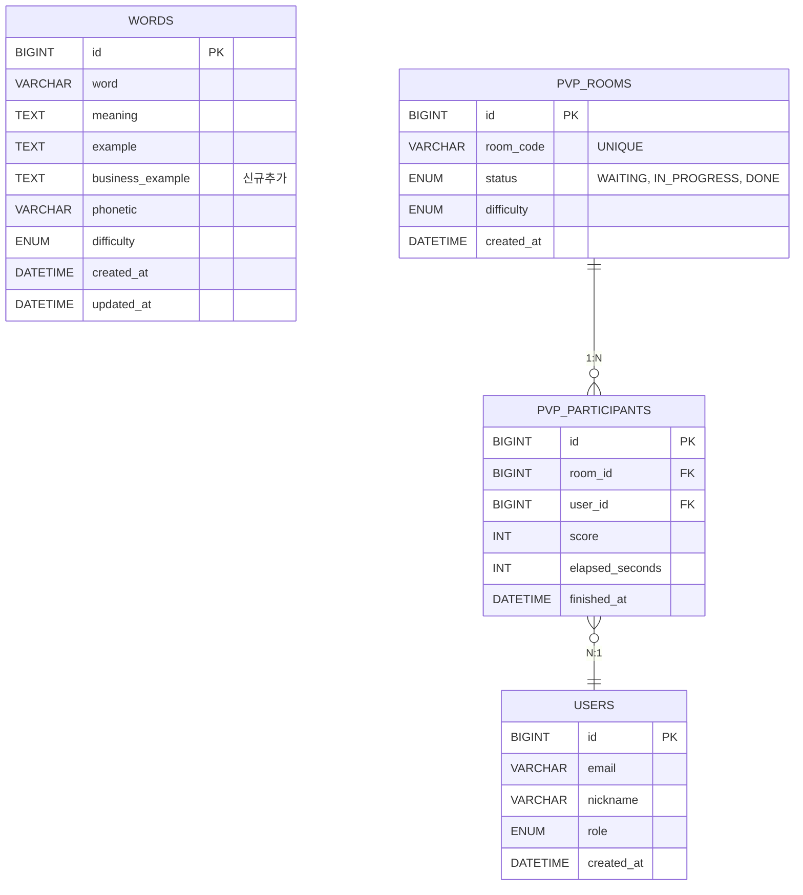

# ERD (Entity Relationship Diagram)

## Phase 1 — users · words · quiz_sessions · quiz_answers · wrong_notes

---

## Phase 2 — +word_ranking · word_relations · word_phrases / words.phonetic · quiz_sessions.last_answered_index

---

## Phase 3 — +pvp_rooms · pvp_participants / words.business_example

