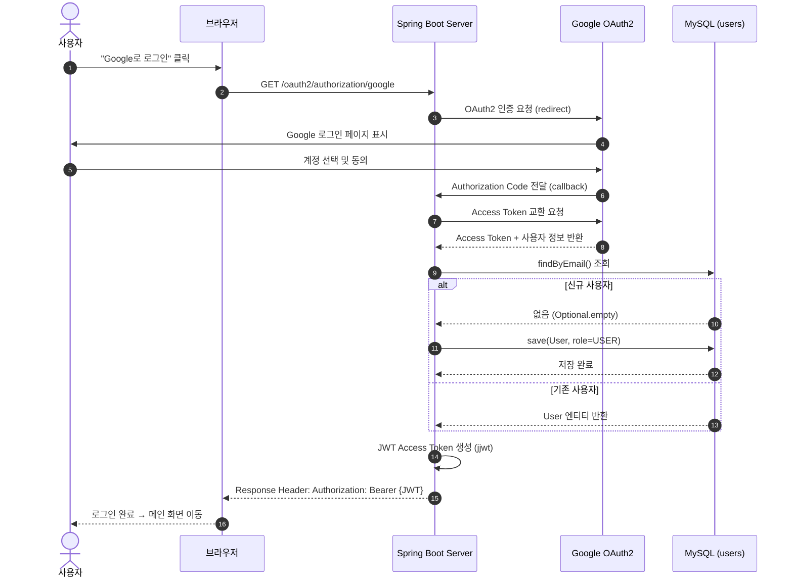
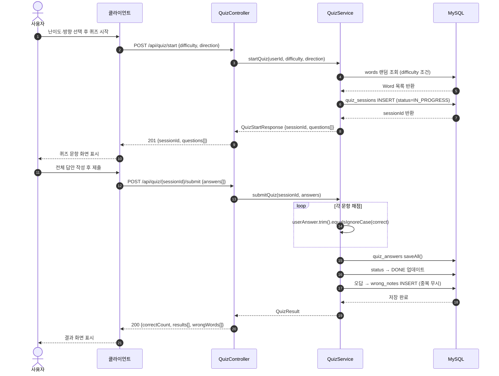
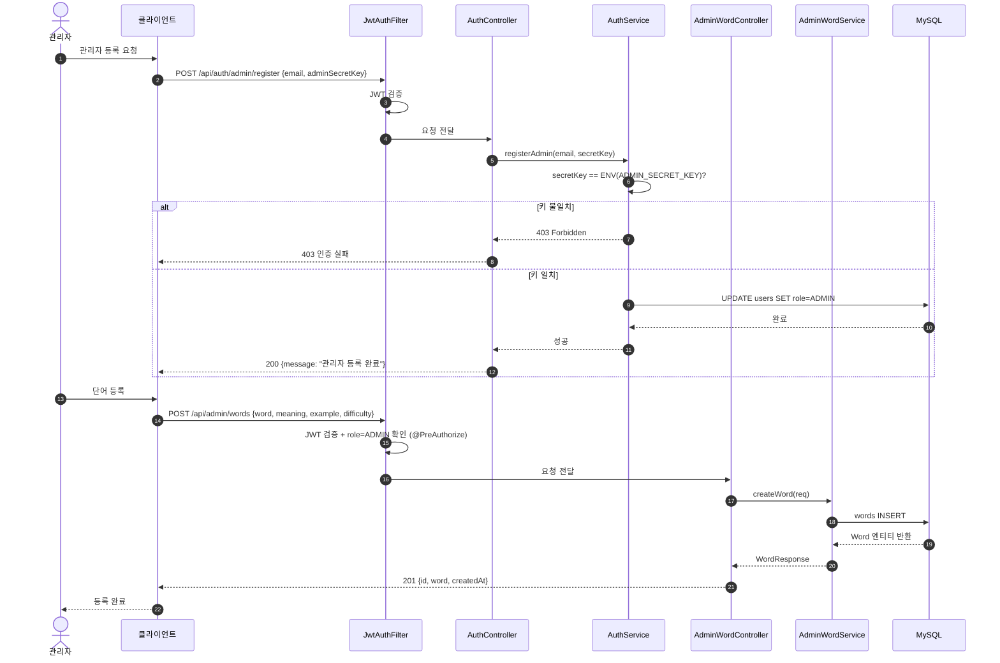
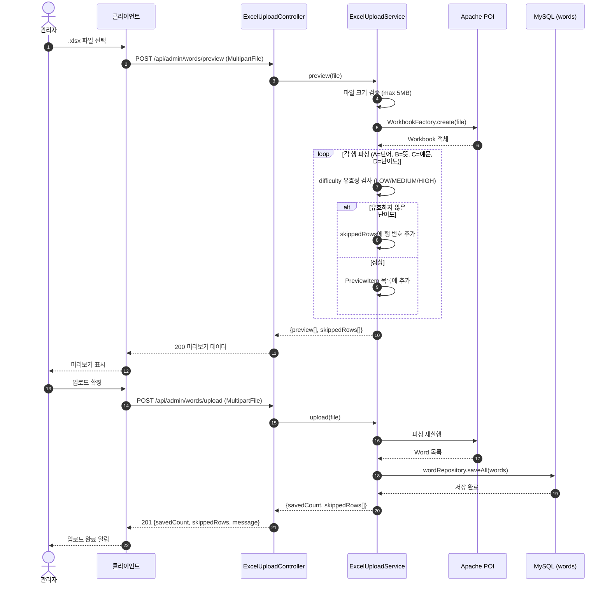
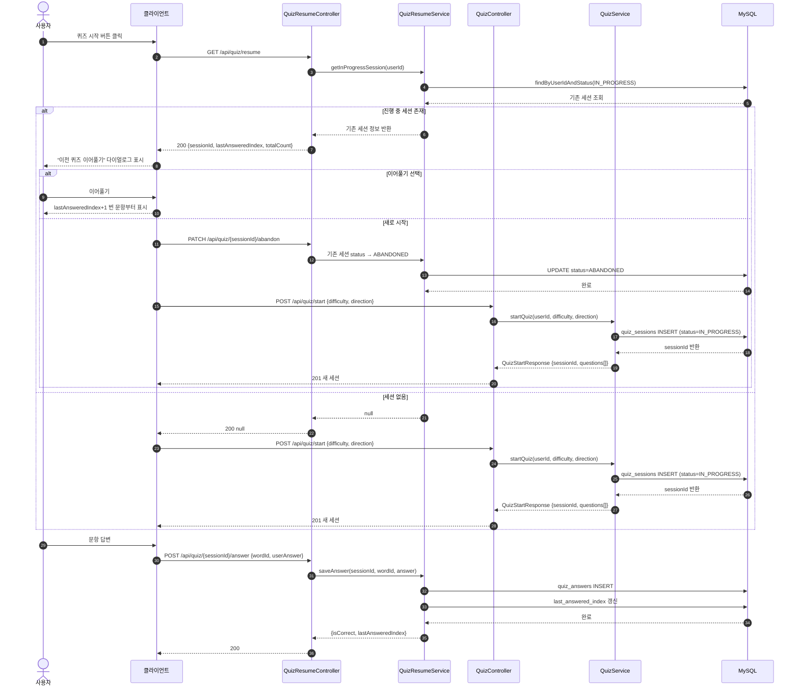
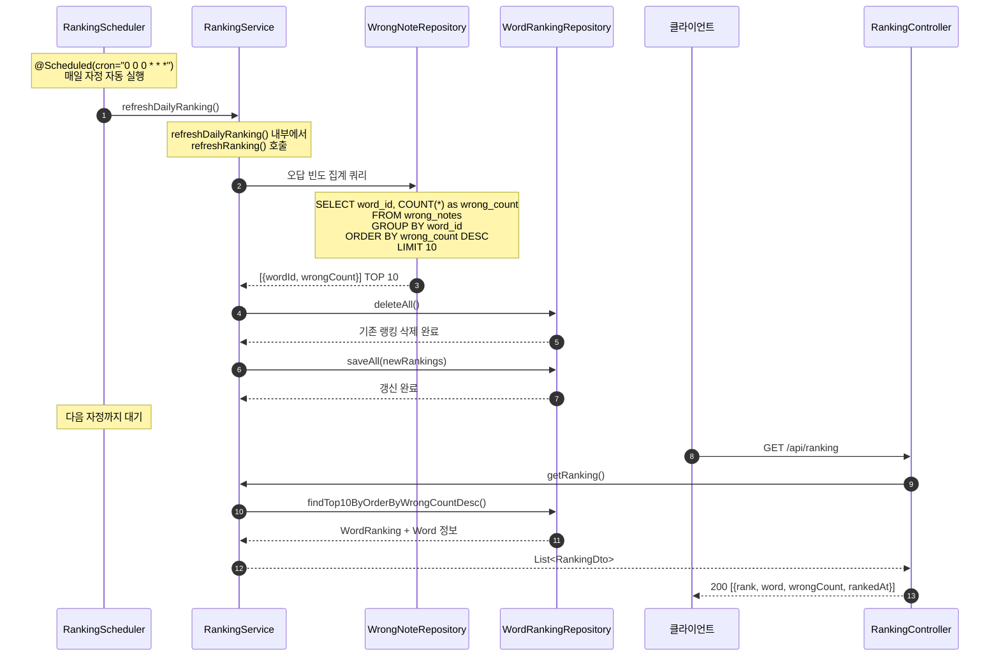
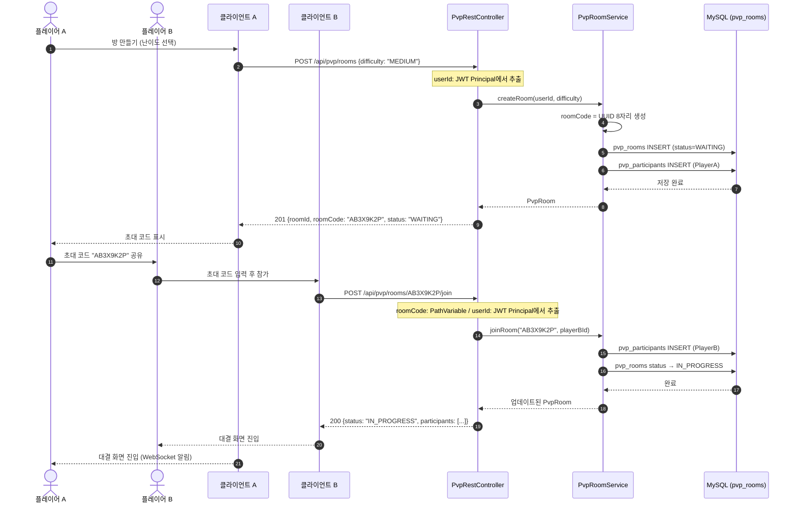
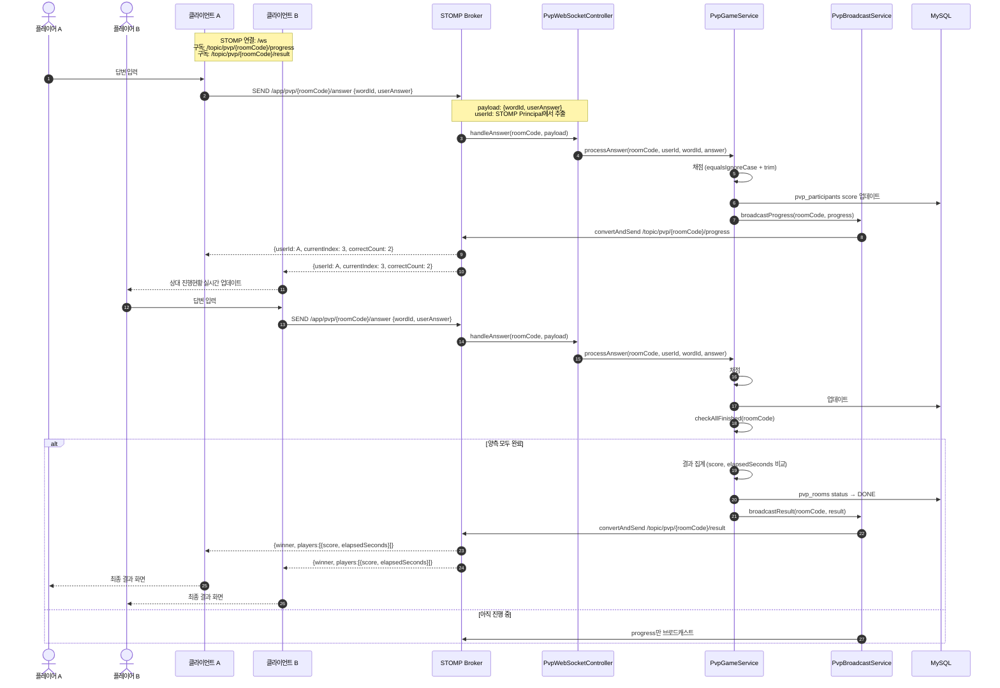
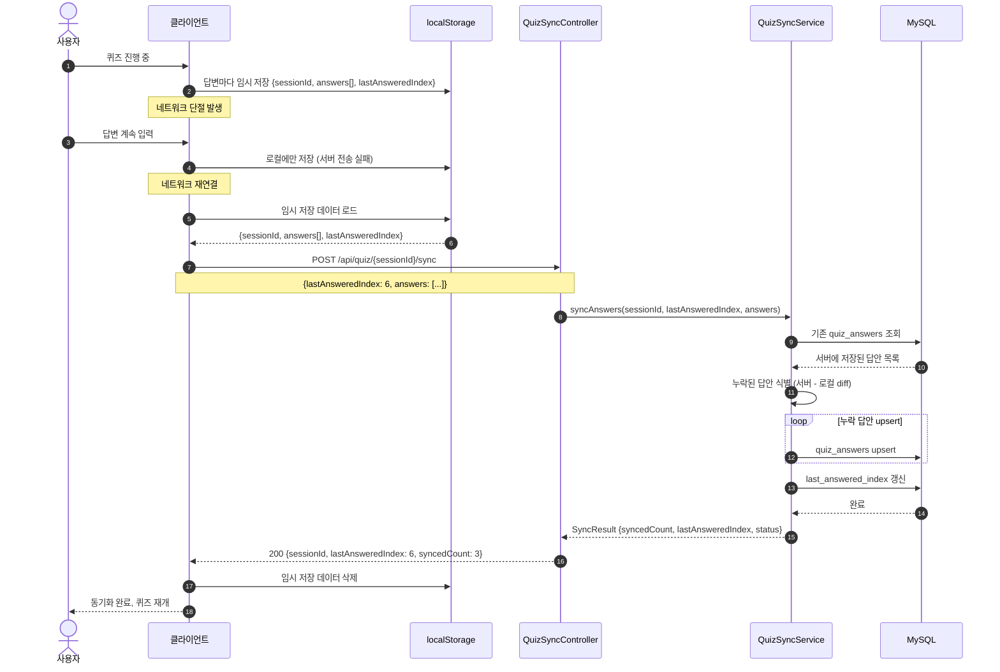

# Sequence Diagrams

## Phase 1 — MVP

### ① SSO 로그인 · JWT 발급

Google OAuth2 로그인 성공 시 JWT 발급 흐름. 신규 사용자는 users 테이블에 자동 저장됩니다.

---

### ② 퀴즈 시작 · 제출 · 채점

퀴즈 세션 생성 → 전체 제출 → equalsIgnoreCase+trim() 채점 → 오답 자동 기록 흐름입니다.

---

### ③ 관리자 단어 등록

관리자 비밀 키 검증 후 단어 등록. @PreAuthorize("hasRole('ADMIN')")으로 보호됩니다.

---

## Phase 2 — 고도화

### ① 엑셀 업로드

Apache POI 파싱 → 미리보기 → 일괄 저장. 난이도 오류 행은 skip 후 행 번호 반환합니다.

---

### ② 퀴즈 이어풀기

기존 IN_PROGRESS 세션 감지 → ABANDONED 처리 or 이어풀기 선택 흐름.
컨트롤러: QuizResumeController, 서비스: QuizResumeService.

---

### ④ 랭킹 자동 갱신

@Scheduled cron "0 0 0 \* \* \*" — 매일 자정 wrong_notes 집계 후 word_ranking 갱신합니다.

---

## Phase 3 — PvP · 오프라인

### ① PvP 방 생성 · 참가

방 생성 → 초대 코드 공유 → 참가자 입장 시 status IN_PROGRESS 전환 흐름입니다.

---

### ② PvP 실시간 대결 (STOMP)

STOMP /app/pvp/{roomCode}/answer 수신 → 채점 → progress 브로드캐스트 → 양측 완료 시 result 전송.

---

### ③ 오프라인 동기화

네트워크 재연결 후 localStorage 임시 데이터 → /sync 엔드포인트(QuizSyncController) → QuizSyncService 누락 답안 upsert 흐름.

