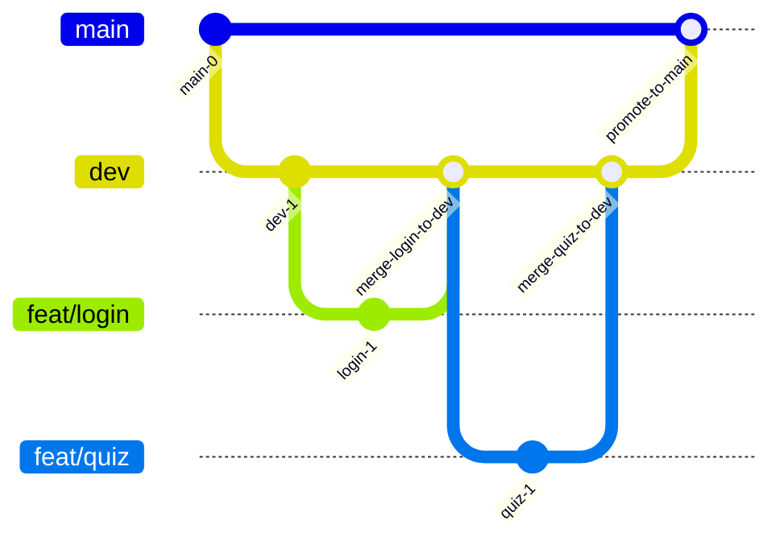

## Git Branching Strategy

팀 브랜치 전략은 `dev` 통합 + `main` 안정 브랜치 모델입니다.

## 1) 모델 비교 요약

| 모델 | 핵심 | 장점 | 주의점 |
| --- | --- | --- | --- |
| Trunk-based | `main` 중심 단일 흐름 | 단순, 빠른 통합/배포 | `main` 품질 리스크 큼 |
| Git Flow | `main/develop/release/hotfix` 분리 | 릴리즈/운영 관리 명확 | 소규모 팀에 과한 복잡도 |
| GitHub Flow | `main` + 짧은 feature 브랜치 PR | 협업 단순, 피드백 빠름 | 배포 품질 게이트 설계 필요 |

## 2) 우리 팀 모델

- `feat/*`, `fix/*`, `refactor/*`, `docs/*`, `chore/*`에서 작업 후 `dev`로 PR
- `dev`는 통합 브랜치로 운영, lint 통과 시 self-merge 허용
- `main`은 배포 가능한 안정 브랜치, triage PR 통과 후만 반영
- `dev -> main` 머지는 과반(2인+Copilot) 동의 기준

## 3) 운영 규칙

- 브랜치 네이밍: `feat/*`, `fix/*`, `refactor/*`, `docs/*`, `chore/*`
- 모든 머지는 PR 기반으로 수행
- `main` 직접 push 금지
- PR 템플릿 기준으로 테스트/체크리스트 작성
- 머지 전 최소 조건: lint 통과, 핵심 흐름 수동 확인, 이슈 링크 연결

## 4) 현재 반영 사례

- `chore/restructure`
  - 목적: TOKKI 저장소를 `frontend/`, `backend/`, `scripts/` 구조로 정리
  - 커밋: `86192e7 chore: restructure project layout`
  - 통합: `3458b91 Merge branch 'chore/restructure' into dev`
  - 비고: 실제 `.env`는 커밋하지 않고 `.env.example`만 공유
